# Entity-Relationship Diagram (ERD) - Phân hệ Văn bản đi (Outgoing Documents)

Bản tài liệu này mô tả chi tiết sơ đồ quan hệ thực thể (ERD) xung quanh bảng trung tâm **`outgoing_documents`** (Văn bản đi), dựa trên sự đối khớp giữa logic nghiệp vụ thực tế trong `src/outgoing-documents/outgoing-documents.service.ts` và cấu trúc các thực thể TypeORM/bảng cơ sở dữ liệu MSSQL trong hệ thống.

---

## 1. Sơ đồ ERD trực quan (Mermaid Diagram)

Dưới đây là sơ đồ chi tiết biểu diễn mối quan hệ giữa bảng trung tâm `outgoing_documents` và các bảng phụ vệ tinh, bảng danh mục người dùng/đơn vị, cũng như luồng quản lý file đính kèm.

```mermaid
erDiagram
    outgoing_documents ||--o| outgoing_current_state : "1-to-(0..1) document_id"
    outgoing_documents ||--o{ outgoing_assignment : "1-to-N document_id"
    outgoing_documents ||--o{ work_items : "1-to-N document_id"
    outgoing_documents ||--o{ document_star : "1-to-N document_id"
    outgoing_documents ||--o{ audit : "1-to-N document_id"
    outgoing_documents ||--o{ outgoing_document_users : "1-to-N document_id"
    outgoing_documents ||--o{ file_relations : "1-to-N object_id (object_type in docProposol...)"
    
    incomming_documents |o--o| outgoing_documents : "Liên thông copy_to_internal = document_id"
    
    file_relations }|--|| files : "N-to-1 file_id = id"
    files ||--o{ files : "Self-join parent_id = id"
    
    outgoing_document_users }|--|| users : "N-to-1 user_id = id"
    document_star }|--|| users : "N-to-1 user_id = id"
    work_items }|--|| users : "N-to-1 assignee_user_id = id"
    audit }|--|| users : "N-to-1 receiver = id"
    outgoing_current_state }|--|| users : "N-to-1 current_receiver = id"
    
    organization_units ||--o{ organization_units : "Self-join parentId = id"
    users }|--|| organization_units : "N-to-1 parent = id"
    
    outgoing_documents }|--|| organization_units : "N-to-1 sender_unit = id"
    outgoing_documents }|--|| organization_units : "N-to-1 (JSON arrays) internal_receiving_unit = id"
    outgoing_documents }|--|| organization_units : "N-to-1 (JSON arrays) external_receiving_unit = id"
    outgoing_documents }|--|| organization_units : "N-to-1 (JSON parsing) internal_receiving_dept = id"
    
    incomming_documents }|--|| organization_units : "N-to-1 receiver_unit = id"

    outgoing_documents {
        int id PK "Identity"
        varchar document_id UK "Khóa nghiệp vụ chính (Not Null)"
        varchar status_code "Trạng thái nghiệp vụ hiện tại ('1',...)"
        varchar sender_unit FK "Đơn vị gửi -> organization_units.id"
        varchar drafter "Người soạn thảo (username/id)"
        varchar document_type "Loại văn bản"
        varchar urgency_level "Độ khẩn"
        varchar private_level "Độ mật"
        varchar document_field "Lĩnh vực văn bản"
        nvarchar report_signer "Danh sách người ký (JSON array)"
        varchar report_document_symbol "Ký hiệu báo cáo"
        varchar to_book_text_symbols "Ký hiệu vào sổ"
        nvarchar viewers "Người xem (JSON)"
        datetime deadline_reply "Hạn trả lời"
        nvarchar abstract_note "Trích yếu"
        nvarchar recipient_ids "ID người nhận (JSON)"
        nvarchar internal_receiving_unit "Đơn vị nhận nội bộ (JSON)"
        nvarchar external_receiving_unit "Đơn vị nhận bên ngoài (JSON)"
        varchar reply_incomming_doc "Văn bản đến cần phản hồi"
        varchar draft_signer "Người ký nháp"
        int book_document_id FK "ID sổ văn bản"
        int status "Trạng thái xóa/hoạt động (1 = Active)"
        nvarchar commanders "Danh mục chỉ đạo"
        varchar release_no "Số ban hành"
        varchar release_date "Ngày ban hành"
        varchar text_symbols "Ký hiệu văn bản"
        nvarchar internal_receiving_dept "Phòng ban nhận nội bộ (JSON)"
        int type_doc "Loại tài liệu (1,...)"
        varchar bpmn_version "Phiên bản quy trình BPMN"
        bit replaced "Đã bị thay thế (0/1)"
        varchar document_date "Ngày văn bản"
        varchar signature_type "Loại chữ ký (digitalSignature...)"
        bit is_stamp "Đã đóng dấu"
        datetime created_at
        datetime updated_at
    }

    outgoing_current_state {
        nvarchar document_id PK, FK "-> outgoing_documents.document_id"
        nvarchar current_stage_status "Trạng thái xử lý hiện tại"
        nvarchar current_action_code "Mã hành động gần nhất"
        nvarchar current_receiver FK "Người nhận hiện tại -> users.id"
        nvarchar current_role_process "Vai trò quy trình hiện tại"
        datetime2 current_deadline "Hạn chót hiện tại"
        bigint last_audit_id FK "-> audit.id"
        datetime2 last_audit_time "Thời điểm xử lý gần nhất"
        bit is_transfer_to_room "Có chuyển phòng ban"
        bit has_open_workitem "Có công việc đang mở"
        bit is_completed_doc "Văn bản đã hoàn thành"
        bit has_da_xu_ly "Đã được xử lý"
        bit has_ban_hanh "Đã ban hành"
        bit has_ht_vbtt "Hoàn thành văn bản thay thế"
        bigint last_da_xu_ly_audit_id "ID audit đã xử lý cuối cùng"
        bit has_tra_lai_after_da_xu_ly "Bị trả lại sau khi đã xử lý"
        bit dong_dau_cuoi "Đã đóng dấu cuối"
        datetime2 updated_at
    }

    outgoing_assignment {
        nvarchar document_id PK, FK "-> outgoing_documents.document_id"
        nvarchar receiver PK, FK "Người nhận -> users.id hoặc organization_units.id"
        nvarchar role_process PK "Vai trò xử lý (processor/supporter/...)"
        nvarchar stage_status "Trạng thái phân công"
        datetime2 deadline "Hạn chót phân công"
        datetime2 created_at "Thời điểm bắt đầu phân công"
        bigint last_audit_id FK "-> audit.id"
        nvarchar receiver_unit FK "Đơn vị người nhận -> organization_units.id"
        bit is_creator "Là người tạo quy trình"
        datetime2 updated_at
    }

    work_items {
        varchar id PK "Khóa chính uuid"
        varchar document_id FK "-> outgoing_documents.document_id"
        varchar node_id "Node ID trong quy trình BPMN"
        varchar role "Vai trò xử lý trong bước"
        varchar assignee_user_id FK "Người được gán -> users.id"
        varchar node_type "Loại node quy trình"
        varchar state "Trạng thái ('open', 'completed', 'cancelled')"
        timestamp created_at
    }

    document_star {
        nvarchar document_id PK, FK "-> outgoing_documents.document_id"
        nvarchar user_id PK, FK "Người đánh dấu sao -> users.id"
        nvarchar step PK "Bước nghiệp vụ (processFn)"
    }

    audit {
        bigint id PK "Identity"
        nvarchar document_id FK "-> outgoing_documents.document_id"
        datetime time "Thời điểm ghi nhận"
        nvarchar user_id FK "Người thực hiện -> users.id"
        nvarchar display_name "Tên người thực hiện"
        nvarchar role "Vai trò"
        nvarchar action_code "Mã hành động (CREATE, TRANSFER, ...)"
        nvarchar from_node_id "Từ bước quy trình"
        nvarchar to_node_id "Đến bước quy trình"
        nvarchar details "Chi tiết lịch sử xử lý (JSON)"
        nvarchar origin_id "ID gốc"
        nvarchar created_by "Người tạo"
        nvarchar receiver FK "Người nhận tiếp theo -> users.id"
        nvarchar receiver_unit FK "Đơn vị nhận tiếp theo -> organization_units.id"
        nvarchar group_ "Nhóm xử lý"
        nvarchar roleProcess "Vai trò xử lý (processor/supporter)"
        nvarchar action "Tên hành động"
        datetime deadline "Hạn chót"
        nvarchar stage_status "Trạng thái bước xử lý"
        nvarchar curStatusCode "Mã trạng thái hiện tại"
        varchar type_document "Loại văn bản (OutgoingDocument,...)"
        varchar processed_by "Xử lý hộ bởi"
        varchar acting_as "Ủy quyền/Nhập hộ bởi"
        datetime created_at
        datetime updated_at
    }

    outgoing_document_users {
        varchar document_id PK, FK "-> outgoing_documents.document_id"
        nvarchar user_id PK, FK "Người ký -> users.id"
        varchar signer_type PK "Loại người ký (reportSigner/draftSigner/...)"
        int sign_order "Thứ tự ký"
        bit is_signed "Đã ký hay chưa (0/1)"
    }

    file_relations {
        bigint id PK "Identity"
        nvarchar object_type "Loại đối tượng liên kết ('docDraft','docAttachments',...)"
        nvarchar object_id FK "ID đối tượng liên kết -> outgoing_documents.document_id"
        bigint file_id FK "-> files.id"
        int status "Trạng thái (1 = Active)"
        datetime2 created_at
    }

    files {
        bigint id PK "Identity"
        nvarchar file_name "Tên file vật lý"
        nvarchar file_path "Đường dẫn lưu file"
        nvarchar mime_type "Định dạng file"
        bigint file_size "Kích thước file"
        nvarchar description "Mô tả file"
        bit is_directory "Có phải là thư mục"
        bigint parent_id FK "Self-join -> files.id"
        nvarchar file_type "Loại file"
        nvarchar created_by "Tài khoản upload"
        bit is_signed_file "File đã có chữ ký số"
        int status "Trạng thái hoạt động"
        datetime2 created_at
        datetime2 updated_at
    }

    users {
        nvarchar id PK "Khóa chính uuid"
        nvarchar name "Tên đăng nhập"
        nvarchar fullName "Họ và tên đầy đủ"
        nvarchar username "Username đăng nhập"
        nvarchar email_user "Email người dùng"
        nvarchar position "Chức danh nghiệp vụ"
        nvarchar parent FK "Đơn vị công tác -> organization_units.id"
        int status "Trạng thái tài khoản"
        datetime created_at
        datetime updated_at
    }

    organization_units {
        varchar id PK "Mã/ID đơn vị"
        string name "Tên đơn vị/phòng ban"
        string code "Mã đơn vị ký hiệu"
        string type "Loại đơn vị"
        nvarchar mpath "Đường dẫn phả hệ (hierarchy path)"
        nvarchar parentId FK "Self-join -> organization_units.id"
        int status "Trạng thái (1 = Active)"
        int order "Thứ tự sắp xếp"
        datetime created_at
        datetime updated_at
    }

    incomming_documents {
        varchar document_id PK "Khóa chính văn bản đến"
        varchar copy_to_internal FK "Liên kết văn bản đi -> outgoing_documents.document_id"
        varchar receiver_unit FK "Đơn vị nhận văn bản đến -> organization_units.id"
        nvarchar abstract_note "Trích yếu"
        datetime deadline "Hạn chót"
        int status "Trạng thái"
        varchar bpmn_version "Phiên bản quy trình BPMN"
    }
```



---

## 2. Chi Tiết Các Liên Kết (Relationships & Joins)

Hệ thống quản lý văn bản đi sử dụng cấu trúc quan hệ chặt chẽ xung quanh thực thể `outgoing_documents` để đáp ứng các nghiệp vụ: điều phối luồng xử lý quy trình (BPMN), lưu lịch sử vết (Audit), lưu trạng thái xử lý phân công (Current State & Assignment), thống kê ký duyệt và liên kết tài liệu đính kèm.

| Bảng A (Từ) | Bảng B (Đến) | Điều kiện Join (Key mapping) | Loại quan hệ | Ý nghĩa nghiệp vụ / Context Code |
| :--- | :--- | :--- | :--- | :--- |
| `outgoing_documents` | `outgoing_current_state` | `outgoing_current_state.document_id = outgoing_documents.document_id` | **1-to-(0..1)** | **Trạng thái hiện tại**: Truy vấn nhanh trạng thái xử lý tổng quát của văn bản (đã hoàn thành, đang chờ ký, có công việc mở...) mà không cần duyệt ngược bảng lịch sử `audit` tốn hiệu năng. |
| `outgoing_documents` | `outgoing_assignment` | `outgoing_assignment.document_id = outgoing_documents.document_id` | **1-to-Many** | **Phân công chi tiết**: Xác định văn bản đang được giao cho ai (cá nhân `receiver` hoặc đơn vị `receiver_unit`) xử lý với vai trò nào (`processor` - chủ trì, `supporter` - phối hợp...). Lọc theo `userId` hoặc `receiverUnit` để hiển thị danh sách công việc. |
| `outgoing_documents` | `work_items` | `work_items.document_id = outgoing_documents.document_id` | **1-to-Many** | **Công việc hiện tại**: Mối liên kết trực tiếp với công việc của luồng BPMN. Lọc theo trạng thái `state = 'open'` và `assignee_user_id = userId` để xác định nhiệm vụ chưa hoàn thành. |
| `outgoing_documents` | `document_star` | `document_star.document_id = outgoing_documents.document_id` | **1-to-Many** | **Đánh dấu quan trọng (Sao)**: Người dùng đánh dấu yêu thích/quan trọng cho văn bản đi. Kết nối thêm điều kiện `document_star.user_id = currentUserId` và `document_star.step = processFn` (chức năng nghiệp vụ tương ứng). |
| `outgoing_documents` | `audit` | `audit.document_id = outgoing_documents.document_id` | **1-to-Many** | **Lịch sử xử lý**: Ghi nhận toàn bộ vết xử lý (từ ai, đến ai, hành động gì, thời điểm nào, nội dung thảo luận). Dùng để lấy thông tin "người nhận gần nhất" (`join users ON users.id = audit.receiver`). |
| `outgoing_documents` | `outgoing_document_users` | `outgoing_document_users.document_id = outgoing_documents.document_id` | **1-to-Many** | **Thống kê chữ ký**: Quản lý chi tiết danh sách những người ký duyệt văn bản đi (`user_id`), phân loại theo loại người ký (`signer_type` như người ký báo cáo, người ký nháp...) và thứ tự ký (`sign_order`), phục vụ thống kê/kiểm tra tiến trình ký. |
| `outgoing_documents` | `organization_units` | `outgoing_documents.sender_unit = organization_units.id` | **Many-to-1** | **Đơn vị phát hành**: Tham chiếu đến đơn vị/phòng ban phát hành văn bản đi. |
| `outgoing_documents` | `organization_units` | `JSON_VALUE / OPENJSON` | **Many-to-Many** | **Đơn vị nhận**: Map danh sách đơn vị nhận nội bộ/bên ngoài lưu dạng mảng JSON (`internal_receiving_dept`, `internal_receiving_unit`, `external_receiving_unit`) ra bảng danh mục đơn vị để phân quyền hiển thị văn bản liên thông phòng ban. |
| `outgoing_documents` | `incomming_documents` | `incomming_documents.copy_to_internal = outgoing_documents.document_id` | **Many-to-Many (hoặc 1-to-N)** | **Liên thông Văn bản Đến - Đi**: Khi một văn bản đến được xử lý bằng cách ban hành một văn bản đi phản hồi (hoặc ngược lại sao y văn bản đi sang văn bản đến), mối liên kết này được thiết lập kèm điều kiện đơn vị nhận `incomming_documents.receiver_unit = unit_id`. |
| `outgoing_documents` | `file_relations` | `file_relations.object_id = outgoing_documents.document_id` | **1-to-Many** | **Liên kết file**: Mối quan hệ động. Phân loại tài liệu đính kèm thông qua `file_relations.object_type` (ví dụ: `'docProposal'` - Tờ trình, `'docDraft'` - Bản dự thảo, `'docAttachments'` - Phụ lục đính kèm, `'docAnswer'` - Công văn trả lời...). |
| `file_relations` | `files` | `file_relations.file_id = files.id` | **Many-to-1** | **Thông tin file đính kèm**: Lấy chi tiết thông tin file vật lý (tên file, đường dẫn lưu trữ, định dạng, kích thước, lịch sử upload). |
| `users` | `organization_units` | `users.parent = organization_units.id` | **Many-to-1** | **Cơ cấu tổ chức**: Xác định người dùng trực thuộc phòng ban nào để xác định quyền hạn xử lý văn bản theo đơn vị của họ. |

---

## 3. Bản Đồ Thuộc Tính Thực Thể & Kiểu Dữ Liệu Chi Tiết

### A. outgoing_documents (Bảng trung tâm)
- **`id`** (`int`, PK, Identity): Khóa chính tự tăng.
- **`document_id`** (`varchar(100)`, Not Null, Unique Index): Khóa nghiệp vụ chính, dùng làm khóa ngoại (`FK`) kết nối với các bảng trạng thái, phân công và lịch sử.
- **`status_code`** (`varchar(20)`): Trạng thái nghiệp vụ hiện tại của văn bản (VD: `'1'` = Khởi tạo, `'DA_BAN_HANH'`, ...).
- **`sender_unit`** (`varchar(100)`): Đơn vị gửi văn bản đi. Liên kết đến `organization_units.id`.
- **`drafter`** (`varchar(100)`): Tài khoản người soạn thảo văn bản.
- **`document_type`** (`varchar(100)`): Thể loại văn bản (Quyết định, Công văn, Tờ trình...).
- **`urgency_level`** (`varchar(100)`): Độ khẩn (Thường, Khẩn, Hỏa tốc).
- **`private_level`** (`varchar(100)`): Độ mật (Thường, Mật, Tối mật).
- **`document_field`** (`varchar(100)`): Lĩnh vực văn bản.
- **`report_signer`** (`nvarchar(MAX)`): Lưu danh sách JSON những người ký báo cáo/phê duyệt.
- **`viewers`** (`nvarchar(MAX)`): Mảng JSON lưu trữ danh sách tài khoản người dùng được quyền xem văn bản.
- **`internal_receiving_unit`** (`nvarchar(MAX)`): Mảng JSON lưu đơn vị nhận nội bộ.
- **`external_receiving_unit`** (`nvarchar(MAX)`): Mảng JSON lưu đơn vị nhận ngoài tổ chức.
- **`internal_receiving_dept`** (`nvarchar(MAX)`): Mảng JSON lưu phòng ban nhận nội bộ. Dùng hàm `OPENJSON` của MSSQL để bóc tách và join với bảng `organization_units`.
- **`created_at`**, **`updated_at`** (`datetime`): Lưu vết thời gian khởi tạo và cập nhật.

### B. outgoing_current_state (Bảng tối ưu truy vấn trạng thái hiện tại)
Lưu trạng thái xử lý thời gian thực, đồng bộ hóa tự động qua mệnh đề `MERGE` mỗi khi có bản ghi mới trong `audit`.
- **`document_id`** (`nvarchar(100)`, PK, FK): Liên kết đến `outgoing_documents.document_id`.
- **`current_stage_status`** (`nvarchar(100)`): Trạng thái quy trình hiện hành (`DA_XU_LY`, `CHO_KY_CHINH_THUC`, `DA_BAN_HANH`, `TRA_LAI`...).
- **`current_receiver`** (`nvarchar(100)`): ID người nhận thụ lý hiện tại. Liên kết đến `users.id`.
- **`current_role_process`** (`nvarchar(100)`): Vai trò xử lý (chủ trì `processor` / phối hợp `supporter`).
- **`last_audit_id`** (`bigint`): ID bản ghi lịch sử xử lý gần nhất trong `audit`.
- **`is_completed_doc`** (`bit`): Cờ đánh dấu văn bản đã hoàn thành (khi trạng thái là `HOAN_THANH` hoặc `DA_BAN_HANH`).
- **`has_da_xu_ly`** (`bit`): Đã có bất kỳ hành động xử lý nào từ các cấp ký duyệt/đóng dấu chưa.

### C. outgoing_assignment (Bảng phân công công việc)
- **`document_id`** (`nvarchar(100)`, PK, FK)
- **`receiver`** (`nvarchar(100)`, PK, FK): Người nhận xử lý (hoặc Đơn vị nhận xử lý).
- **`role_process`** (`nvarchar(100)`, PK): Vai trò phân công (`processor`, `supporter`, `viewer`...).
- **`stage_status`** (`nvarchar(100)`): Trạng thái cá nhân đối với phân công này (`CHUA_XU_LY`, `DA_XU_LY`, `CHUA_HOAN_THANH`...).

### D. audit (Bảng lịch sử/nhật ký xử lý)
- **`id`** (`bigint`, PK, Identity)
- **`document_id`** (`nvarchar(64)`, FK): ID văn bản.
- **`user_id`** (`nvarchar(64)`): Người thực hiện hành động.
- **`action_code`** (`nvarchar(64)`): Mã hành động nghiệp vụ (VD: `CREATE` - Tạo mới, `TRANSFER` - Chuyển xử lý, `SIGN` - Ký duyệt, `STAMP` - Đóng dấu, `RETURN` - Trả lại).
- **`receiver`** (`nvarchar(100)`): Người nhận kết quả xử lý tiếp theo.
- **`receiver_unit`** (`nvarchar(100)`): Đơn vị nhận kết quả xử lý tiếp theo.
- **`details`** (`nvarchar(MAX)`): Lưu trữ thông tin chi tiết dưới dạng JSON (ví dụ thông tin cấu hình luồng BPMN, nội dung ý kiến xử lý).

---

## 4. Phân tích Khuyến nghị Tối ưu hóa Database & Chỉ mục (Indexes)

Dựa trên cấu trúc quan hệ phức tạp và các câu lệnh truy vấn thực tế được dùng trong `outgoing-documents.service.ts`, dưới đây là các chỉ mục quan trọng cần được đảm bảo thiết lập trong Database MSSQL để đạt hiệu năng tối ưu:

1. **Khóa Ngoại & Chỉ Mục Liên Kết Trực Tiếp (Foreign Key Indexes):**
   - Tạo chỉ mục phi vật lý (Non-Clustered Index) cho cột `document_id` trên các bảng vệ tinh:
     ```sql
     CREATE NONCLUSTERED INDEX IX_outgoing_current_state_doc_id ON outgoing_current_state(document_id);
     CREATE NONCLUSTERED INDEX IX_outgoing_assignment_doc_id ON outgoing_assignment(document_id);
     CREATE NONCLUSTERED INDEX IX_work_items_doc_id_state ON work_items(document_id, state);
     CREATE NONCLUSTERED INDEX IX_audit_doc_id ON audit(document_id);
     CREATE NONCLUSTERED INDEX IX_outgoing_document_users_doc_id ON outgoing_document_users(document_id);
     CREATE NONCLUSTERED INDEX IX_file_relations_obj_type_obj_id ON file_relations(object_type, object_id, status);
     ```

2. **Tối ưu hóa Truy vấn Lọc Danh sách theo Người Dùng (Assignment & Current State):**
   - Bảng `outgoing_assignment` thường xuyên được truy vấn lọc theo người nhận (`receiver` / `receiver_unit`) kết hợp với trạng thái phân công:
     ```sql
     CREATE NONCLUSTERED INDEX IX_outgoing_assignment_receiver_status ON outgoing_assignment(receiver, stage_status) INCLUDE (document_id, role_process);
     ```

3. **Truy vấn Đánh dấu Sao (document_star):**
   - Thao tác kiểm tra hoặc lọc văn bản đã đánh dấu sao thường join `document_star` theo `document_id`, `user_id` và `step`:
     ```sql
     CREATE NONCLUSTERED INDEX IX_document_star_user_step ON document_star(user_id, step) INCLUDE (document_id);
     ```

4. **Lưu ý Đặc biệt với Các Cột Mảng JSON (`nvarchar(MAX)`):**
   - Các cột chứa JSON trong `outgoing_documents` như `internal_receiving_dept` hay `report_signer` khi sử dụng hàm `OPENJSON` hay `JSON_VALUE` để truy vấn trực tiếp sẽ gây ra hiện tượng Table Scan (quét toàn bộ bảng) đối với hệ cơ sở dữ liệu lớn.
   - **Khuyến nghị**: Đối với các thuộc tính lọc hoặc phân quyền liên thông cốt lõi (như đơn vị nhận), nên chuẩn hóa ra các bảng quan hệ 1-N hoặc N-N phụ thay vì lưu trữ dạng JSON thô trong cột lớn nếu lượng bản ghi văn bản vượt quá 100.000 dòng.
